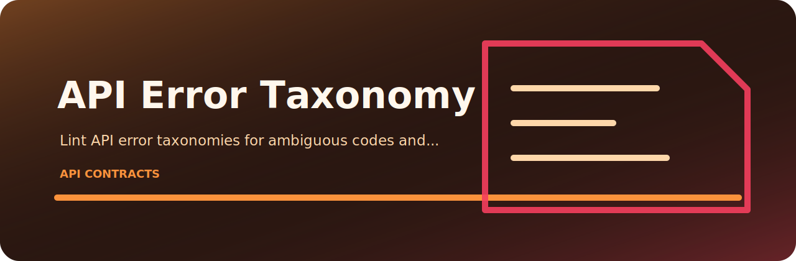
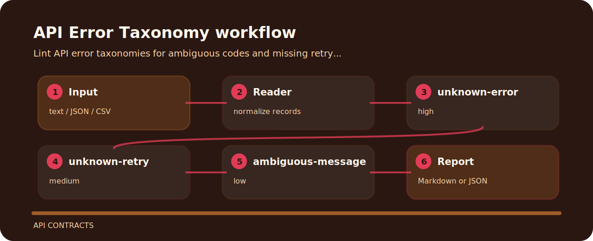

# API Error Taxonomy



Lint API error taxonomies for ambiguous codes and missing retry guidance. It keeps the review small: one input file, a short list of findings, and enough context to fix the line that caused the warning.

## Finding map



## Review notes

| Signal | Level | What it flags | Fix direction |
| --- | --- | --- | --- |
| `unknown-error` | high | unknown error code detected | replace with specific error code |
| `unknown-retry` | medium | retry guidance missing | document retry behavior |
| `ambiguous-message` | low | message is ambiguous | make message actionable |

## Fresh clone path

```bash
git clone https://github.com/mertefekurt/api-error-taxonomy.git
cd api-error-taxonomy
python -m pip install -e ".[dev]"
api-error-taxonomy examples/sample.txt
```

## Before the fix

```text
risky: error UNKNOWN retry unknown http 500 message ambiguous
clean: error RATE_LIMIT retry after http 429 message clear
```
